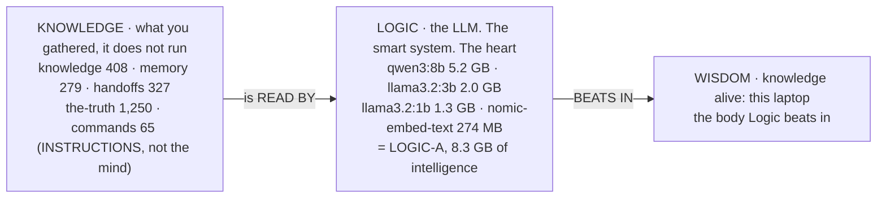
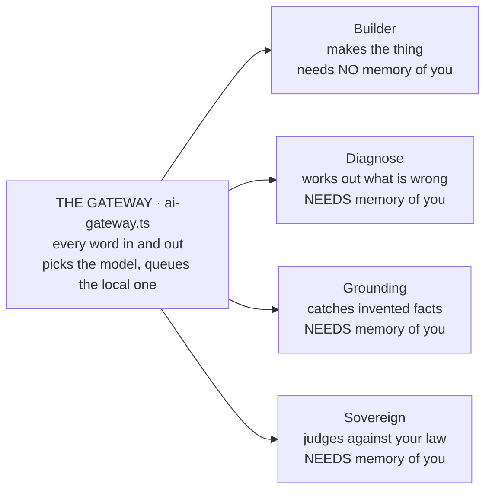
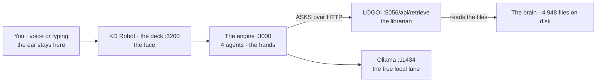
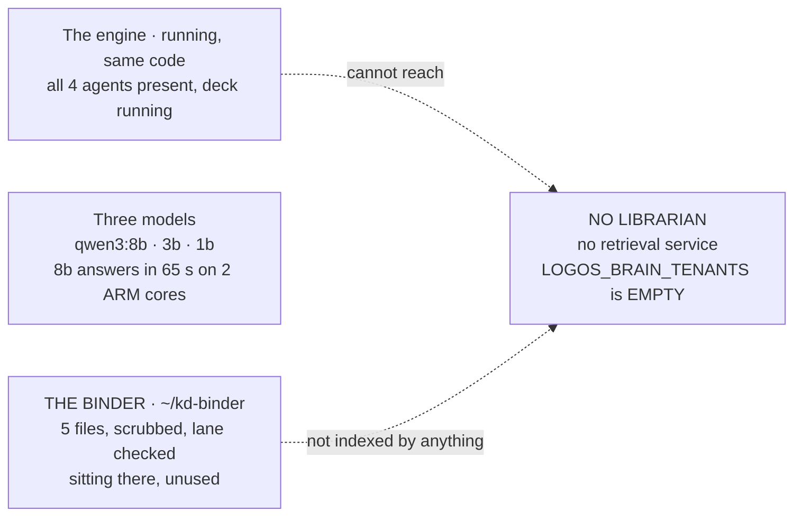
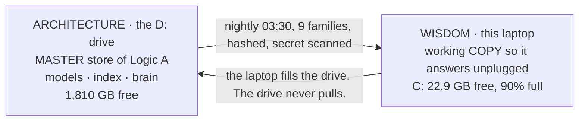
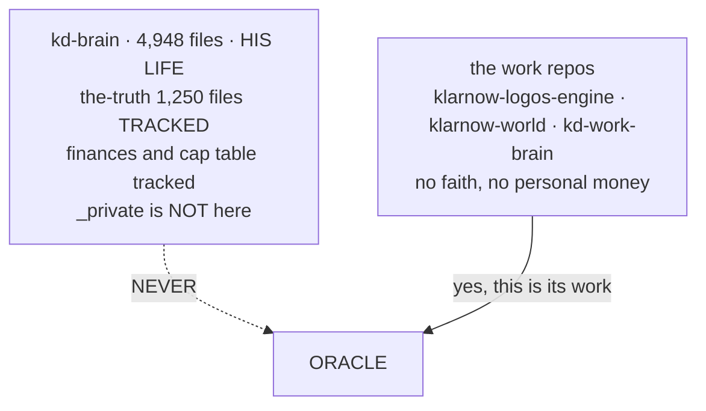

# The Two Hearts · schematics of the whole infrastructure

> King, 9 Sep 2026: *"like logic is the heart so the wisdom heart is also logic b we need t see
> scemactics of how the brain works alone then the engine with agents then the both combined live
> and same for logic b engine with agents. same for hardrive and github"*

Every number below was read off the laptop or off Oracle over SSH on 9 Sep 2026, not recalled.
Published version with drawn diagrams: artifact `406866e2-9270-465d-88a0-a942acbfc7dd`.
Related: [[project_kd_robot_stage6_console_2026-09-06]] · [[project_doors_and_cost_2026-09-09]] ·
[[project_logic_binder_2026-09-07]]

---

## 1 · The brain, on its own, and what Logic actually is

> **CORRECTION, King, 9 Sep:** *"Logic is a llm its a smart system is that clear?"* then
> *"if you connected it to a machine with files and folders it will correct and build it"*.
> The first draft of this page drew Logic as the `commands/` folder. That was wrong.



**Logic is the LLM.** It is the smart system, the part that actually thinks. The skills sit in
KNOWLEDGE with everything else, because a skill is an instruction and instructions do not reason.
Logic reads them and reasons.

That is why "heart" is the right word and why there are two of them. **LOGIC-A beats inside Wisdom
here on the laptop; LOGIC-B beats on Oracle. Same organ, two bodies, so one can rest.**

Files with no LLM is a library. An LLM with no files is a stranger.

> [!warning] A contradiction in his own constitution, flagged not fixed (Rule 19)
> `CLAUDE.md` still says *"L = Logic, the /command, the skill/trigger that runs it all"* and
> *"the skill layer of this brain is called Logic"*. His 8 Sep ruling named LOGIC-A as the
> laptop's Ollama models, which only holds if Logic is the LLM. Read as growth rather than error,
> the same shape as the engine being what Logic became: **Logic started as the written word and
> became a thinking one.** The constitution has not caught up. **That edit is King's to approve.**

> [!warning] The fact that decides section 6
> `the-truth`, the faith lane, is **1,250 files and tracked in git**. Inside the private repo, not
> the open internet, but anything that clones the brain gets the confession records with it.
> `_private` is gitignored and does NOT go to GitHub.

---

## 1b · King's own formula, which settles the Oracle question

```
   LOGIC        +      A MACHINE      +      FILES        =   IT CORRECTS AND BUILDS
   the LLM             somewhere            folders it        (his words, 9 Sep)
   thinks, cannot      to run               can read          not just does as told
   remember            the body             the memory
```

| machine | LLM | body | files | result |
|---|---|---|---|---|
| **WISDOM**, the laptop | yes, 8.3 GB | yes | yes, all 4,948 | **corrects and builds** |
| **LOGIC-B**, Oracle | yes, 3 models | yes, never sleeps | **NO** | builds what it is told, corrects nothing |

**Oracle has two of the three parts.** That is precisely why three of its four agents refuse to
start and the one that runs can only assemble what it is handed. The fix is one part, not a
rebuild: the binder is already on that box, scrubbed and checked since 7 Sep. It needs a librarian
standing in front of it so the agents are allowed to read.

---

## 2 · The engine and its agents, on their own



The engine is **not a sibling of the brain. It is what LOGIC became** when it needed to run itself,
choose models and count its own tokens (King's own correction, 8 Sep, confirmed). That is why this
section sits second and not beside the first.

Note which agents need memory. **Building does not require knowing King. Judging does.** On its own
the engine has hands and no memory, so one of its four workers can do its job and three refuse.

---

## 3 · Both together, live on the laptop



All five services answered when checked on 9 Sep: 3000, 3200, 5056, 11434, 3456.

> [!important] The gate is built into the shape, not promised in a rule
> **The engine never opens a single brain file and never did.** `src/lib/brain.ts` calls the
> librarian over HTTP and receives a few passages back. `mayUseBrain(tenant)` gates that call
> against `LOGOS_BRAIN_TENANTS`; a tenant not on the list gets `[]` and the agent stands down.
>
> So whatever the librarian has not indexed, the agents cannot see. To change what an agent can
> see, change what the librarian indexes. Nothing else needs trusting, and nobody has to remember
> a rule.

---

## 4 · Logic B, the second heart, as it stands tonight



| agent | on Oracle tonight |
|---|---|
| Builder | works |
| Diagnose | refuses |
| Grounding | refuses |
| Sovereign | refuses |

Measured 9 Sep: 2 cores, 10,898 MB RAM with **7,192 MB available** (the morning's keep-warm fix is
holding), three models installed, no `commands/` folder in the engine, binder present since 7 Sep
and gaining a `commands/` and `tools/` folder at 10:20 today when `/doors` shipped.

**Oracle already has King's memory. It simply cannot reach it.** The shelf is there and nobody is
allowed behind the desk.

### RULED 9 Sep, King: point the agents at the binder

> *"point agents to binder let them adjust and fix and remember they need to be updating github and
> adjust therefore they have to read github brain which is kings infrastructure"*

In this architecture that means exactly one thing: **stand a librarian up on Oracle, indexed over
the binder only**, then set the permission list. All four agents wake, seeing the index card and
nothing beyond it. It is a small change, not a stage.

---

## 5 · The drive, and what the meter means



**Why the meter drops to 85.** The drive is the master and the laptop holds a copy. Pull the drive
and nothing breaks, because the copy still answers. What has been lost is the master, so the meter
is telling the truth rather than reporting a failure.

---

## 6 · GitHub, the spine, and the one line not to cross



Five repos on the account, all private: `kd-brain`, `kd-work-brain`, `klarnow-logos-engine`,
`klarnow-world` (created and pushed today), `.antigravity-ide`.

### The distinction King's instruction turns on

He said the agents have to read the GitHub brain in order to update GitHub. In this design those
are **two separate channels**:

| the job | what it actually needs |
|---|---|
| PUSH to GitHub | a git credential scoped to the repos it works on |
| REMEMBER King | a librarian indexed over the binder |

Neither one requires `kd-brain`. Writing to a repo is git plus a credential; remembering King is
retrieval. So the agents can have both jobs **and the faith lane stays home**.

> [!danger] The one move that needs King's explicit yes
> Everything else here can be wired from what he has already ruled. Giving Oracle the ability to
> clone `kd-brain` is the single change that cannot be undone, because once those 1,250 faith
> files are on that box and in its git history, they are on that box. His own standing rule (25
> Aug) is that faith content never reaches a cloud node.

---

## What this page changes

1. The Oracle question is smaller than it looked. The binder is already there; the librarian is not.
2. The boundary is architectural, not procedural. That is a much stronger guarantee than a rule.
3. Updating GitHub and remembering King are separate channels, so both of King's asks can be met
   without his faith lane leaving the laptop.

---

## Where this lives

| place | how to get to it |
|---|---|
| Published page | artifact `406866e2-9270-465d-88a0-a942acbfc7dd` |
| Obsidian | this file. `kdbrain` is already a vault, so it renders natively |
| Notion | private page "The Two Hearts, KD Robot schematics" |
